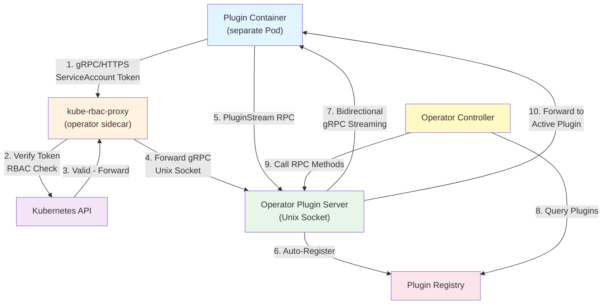

# Operator Plugin Framework

A reusable, generic gRPC-based plugin framework for Kubernetes operators and controllers. Enables bidirectional streaming communication between operators and external plugins with **production-ready infrastructure** and **Kubernetes-native security**.

## What This Framework Provides

This framework solves a common problem: **How to make your Kubernetes operator extensible without building plugin infrastructure from scratch.**

Instead of hardcoding provider logic into your operator, this framework lets you:
- ✅ Define a clean gRPC interface for your business logic
- ✅ Load plugins dynamically from external processes
- ✅ Communicate securely using Kubernetes ServiceAccount tokens + kube-rbac-proxy
- ✅ Scale plugins independently from the operator
- ✅ Maintain bidirectional streaming for real-time updates

### Real-World Example
The **Token Renewer** operator uses this framework to support multiple token providers (Linode, AWS, etc.) as separate plugins—each running in its own container. New providers can be added without modifying the operator code.

## Features

- **Bidirectional gRPC Streaming**: Full-duplex communication between operator and plugins
- **Plugin Registry**: Thread-safe plugin discovery and lifecycle management
- **Automatic Plugin Registration**: Plugins register on connection via streaming RPC
- **Kubernetes-Native Security**: ServiceAccount token authentication via kube-rbac-proxy
- **Controller-Runtime Integration**: Built with `controller-runtime` for seamless K8s integration
- **Type-Safe Protocol Buffers**: Generated from `.proto` definitions
- **Production-Ready**: Comprehensive unit and e2e tests included

## Communication Flow



**Flow Explanation:**
1. **Plugin Connection**: Plugin connects via HTTPS (gRPC over TLS) with its Kubernetes ServiceAccount token
2. **kube-rbac-proxy Verification**: Sidecar validates token with Kubernetes API and checks RBAC policies
3. **Secure Forward**: Proxy forwards authenticated gRPC request to operator's Unix socket
4. **Auto-Registration**: Plugin registers itself in the operator's registry on connection
5. **Bidirectional Streaming**: Plugin and operator exchange gRPC messages over persistent stream
6. **Operator Access**: Controller queries registry and calls plugin methods as needed

## Architecture Overview

### Core Components

1. **Server** (`server/`): gRPC server managing bidirectional plugin connections
   - Listens on Unix domain sockets for low-latency communication
   - Automatic plugin registration on connection
   - Stream management for persistent bidirectional communication
   - Expects all connections to come through kube-rbac-proxy (pre-authenticated)
   - Options for customization (max connections, etc.)

2. **Registry** (`registry/`): Thread-safe plugin registry
   - Register/unregister plugins dynamically
   - Retrieve plugins by name
   - List all active plugins
   - Protects against concurrent access with mutex

3. **Client** (`client/`): Plugin connection helpers
   - ServiceAccount token-based authentication
   - Connects through kube-rbac-proxy for secure communication
   - Stream adapter for bidirectional communication
   - **Token Provider Architecture**: Flexible authentication through TokenProvider interface
   - Support for ServiceAccount tokens, static tokens, and custom providers

4. **Test Utilities** (`test/`): E2E testing infrastructure
   - Stream manager testing
   - Plugin communication testing

## Using This Framework in Your Operator

### Step 1: Define Your Plugin Interface

Create a Protocol Buffer definition for your plugin's business logic:

```protobuf
// proto/myprovider.proto
syntax = "proto3";

package myprovider;

service MyProvider {
  rpc DoSomething(DoSomethingRequest) returns (DoSomethingResponse);
}

message DoSomethingRequest {
  string param = 1;
}

message DoSomethingResponse {
  string result = 1;
}
```

### Step 2: Initialize the Server in Your Operator

```go
import "github.com/guilhem/operator-plugin-framework/server"

// In your controller setup (cmd/main.go or controller init):
func setupPluginServer(mgr ctrl.Manager) (*server.Server, error) {
    // Server listens for pre-authenticated connections from kube-rbac-proxy
    pluginServer := server.New("unix:///tmp/plugins.sock")
    
    // Add server to manager (implements controller-runtime Runnable interface)
    // This will start the server when the manager starts
    if err := mgr.Add(pluginServer); err != nil {
        return nil, err
    }
    
    registry := pluginServer.GetRegistry()
    log.Info("Plugin server configured", "address", "unix:///tmp/plugins.sock")
    
    return pluginServer, nil
}
```

**Note:** The server implements the `controller-runtime` `Runnable` interface, so it should be added to your manager rather than started manually. The manager will handle starting and stopping the server lifecycle.

### Step 3: Query Plugins in Your Reconciliation Logic

```go
// In your reconciler:
func (r *MyResourceReconciler) Reconcile(ctx context.Context, req ctrl.Request) (ctrl.Result, error) {
    resource := &myv1.MyResource{}
    if err := r.Get(ctx, req.NamespacedName, resource); err != nil {
        return ctrl.Result{}, err
    }
    
    // Get the plugin provider name from your CR
    providerName := resource.Spec.ProviderName
    
    // Retrieve plugin from registry
    plugin, err := r.PluginRegistry.Get(providerName)
    if err != nil {
        return ctrl.Result{}, fmt.Errorf("plugin not found: %w", err)
    }
    
    // Call plugin method (implement your gRPC logic here)
    // result, err := plugin.DoSomething(ctx, request)
    
    return ctrl.Result{}, nil
}
```

### Step 4: Deploy Plugins with kube-rbac-proxy

Each plugin runs as a separate container with kube-rbac-proxy sidecar for security:

```yaml
apiVersion: apps/v1
kind: Deployment
metadata:
  name: myprovider-plugin
spec:
  template:
    spec:
      serviceAccountName: myprovider-plugin
      containers:
      # Plugin container
      - name: plugin
        image: my-registry/myprovider-plugin:latest
        env:
        - name: PLUGIN_NAME
          value: "myprovider"
        - name: OPERATOR_ENDPOINT
          value: "https://operator-kube-rbac-proxy:8443"
        volumeMounts:
        - name: sa-token
          mountPath: /var/run/secrets/kubernetes.io/serviceaccount
          readOnly: true
      
      # kube-rbac-proxy sidecar - handles authentication
      - name: kube-rbac-proxy
        image: quay.io/brancz/kube-rbac-proxy:v0.18.0
        args:
        - "--secure-listen-address=0.0.0.0:8443"
        - "--upstream=unix:///tmp/operator.sock"
        - "--kubeconfig=/etc/kube-rbac-proxy/kubeconfig"
        - "--v=2"
        ports:
        - containerPort: 8443
          name: https
        volumeMounts:
        - name: kubeconfig
          mountPath: /etc/kube-rbac-proxy
          readOnly: true
      
      volumes:
      - name: kubeconfig
        configMap:
          name: kube-rbac-proxy-config
      - name: sa-token
        projected:
          sources:
          - serviceAccountToken:
              audience: "myprovider-plugin"
              expirationSeconds: 3600
              path: token
```

### Step 5: Configure RBAC for kube-rbac-proxy and Plugins

**Two sets of RBAC are required:**

#### A. RBAC for kube-rbac-proxy (Operator side)

The operator's kube-rbac-proxy needs permissions to validate tokens:

```yaml
apiVersion: rbac.authorization.k8s.io/v1
kind: ClusterRole
metadata:
  name: operator-proxy-role
rules:
  # kube-rbac-proxy requires permissions to validate ServiceAccount tokens
  - apiGroups: ["authentication.k8s.io"]
    resources: ["tokenreviews"]
    verbs: ["create"]
  # Required for SubjectAccessReview to validate RBAC policies
  - apiGroups: ["authorization.k8s.io"]
    resources: ["subjectaccessreviews"]
    verbs: ["create"]
---
apiVersion: rbac.authorization.k8s.io/v1
kind: ClusterRoleBinding
metadata:
  name: operator-proxy-rolebinding
roleRef:
  apiGroup: rbac.authorization.k8s.io
  kind: ClusterRole
  name: operator-proxy-role
subjects:
  - kind: ServiceAccount
    name: operator-controller-manager  # Your operator's ServiceAccount
    namespace: operator-system
```

#### B. RBAC for Plugin Access via kube-rbac-proxy (Plugin side)

Plugins connect to the operator via **HTTPS** (gRPC over TLS) through kube-rbac-proxy, which then forwards to the operator's Unix socket. The HTTPS endpoint must be protected with RBAC:

```yaml
apiVersion: rbac.authorization.k8s.io/v1
kind: ClusterRole
metadata:
  name: plugin-access-role
rules:
  # Grant plugin access to the gRPC endpoint exposed by kube-rbac-proxy
  # This protects the HTTPS endpoint that plugins connect to
  # The path depends on your gRPC service design
  - nonResourceURLs: ["/"]
    verbs: ["get", "post"]
---
apiVersion: rbac.authorization.k8s.io/v1
kind: ClusterRoleBinding
metadata:
  name: myprovider-plugin-access
roleRef:
  apiGroup: rbac.authorization.k8s.io
  kind: ClusterRole
  name: plugin-access-role
subjects:
  - kind: ServiceAccount
    name: myprovider-plugin
    namespace: default
```

**Note:** For gRPC, use `nonResourceURLs: ["/"]` to allow access to all gRPC methods, or specify specific paths if your proxy is configured to map gRPC methods to HTTP paths.

#### C. RBAC for Plugin's Business Logic (Optional)

If your plugin needs to access Kubernetes resources directly (e.g., read Secrets, ConfigMaps):

```yaml
apiVersion: rbac.authorization.k8s.io/v1
kind: ClusterRole
metadata:
  name: myprovider-plugin-k8s-access
rules:
  # Allow plugin to read resources needed for its provider logic
  - apiGroups: [""]
    resources: ["configmaps", "secrets"]
    verbs: ["get", "list", "watch"]
  - apiGroups: ["mycompany.com"]
    resources: ["myresources"]
    verbs: ["get", "list"]
---
apiVersion: rbac.authorization.k8s.io/v1
kind: ClusterRoleBinding
metadata:
  name: myprovider-plugin-k8s-access
roleRef:
  apiGroup: rbac.authorization.k8s.io
  kind: ClusterRole
  name: myprovider-plugin-k8s-access
subjects:
  - kind: ServiceAccount
    name: myprovider-plugin
    namespace: default
```

## Security Architecture: kube-rbac-proxy

### Why kube-rbac-proxy?

This framework uses **kube-rbac-proxy** as a sidecar to secure plugin-to-operator communication:

- **No custom auth code**: Delegates to Kubernetes RBAC system
- **Token validation**: Verifies ServiceAccount tokens against Kubernetes API
- **RBAC enforcement**: Each plugin can have specific permissions
- **TLS termination**: Encrypts traffic between plugin and operator
- **Audit-friendly**: All access is logged through Kubernetes audit trail

### How It Works

```
Plugin Process (gRPC client)
    ↓
    │ HTTPS connection with ServiceAccount Token
    │ (gRPC over TLS)
    ↓
kube-rbac-proxy (validates token, checks RBAC on HTTPS endpoint)
    ↓
    │ Only forward if authorized
    │ Forwards to Unix socket
    ↓
Operator gRPC Server (receives pre-authenticated gRPC requests via Unix socket)
```

**Key Points:**
- Plugins connect via **HTTPS** (port 8443) using gRPC over TLS
- kube-rbac-proxy validates the ServiceAccount token and RBAC permissions
- Validated requests are forwarded to the operator's **Unix socket**
- The operator never sees unauthenticated requests

### Token Authentication Architecture

The framework uses a flexible **TokenProvider** pattern for authentication:

```go
// TokenProvider interface for obtaining authentication tokens
type TokenProvider interface {
    GetToken() (string, error)
}

// TokenCredential implements gRPC credentials using a TokenProvider
type TokenCredential struct {
    Provider TokenProvider
}
```

**Built-in Providers:**
- `ServiceAccountTokenProvider`: Reads tokens from Kubernetes ServiceAccount mounts
- `StaticTokenProvider`: Uses fixed tokens (for testing)

**Client Options:**
- `WithServiceAccountToken()`: Uses default ServiceAccount token path
- `WithStaticToken(token)`: Uses fixed token for testing
- `WithTokenProvider(provider)`: Uses custom TokenProvider implementation

**Validation:** Token providers are validated at connection time by attempting to retrieve a token before establishing the gRPC connection. This ensures authentication issues are caught early.

### Configuration

kube-rbac-proxy requires:

1. **Operator ServiceAccount**: The operator's ServiceAccount needs permissions for token validation
   - `tokenreviews.create` (authentication.k8s.io)
   - `subjectaccessreviews.create` (authorization.k8s.io)

2. **Plugin ServiceAccount**: Each plugin has its own ServiceAccount

3. **Plugin Access ClusterRole**: Defines which plugins can connect to the operator via HTTPS
   - Use `nonResourceURLs` to control access to the gRPC endpoint exposed by kube-rbac-proxy
   - Example: `nonResourceURLs: ["/"]` for full gRPC access

4. **Plugin Business Logic RBAC** (optional): If plugins need to access K8s resources
   - Grant necessary permissions to plugin ServiceAccount
   - Example: Read Secrets, ConfigMaps, or custom resources

5. **kube-rbac-proxy flags**:
   - `--secure-listen-address=0.0.0.0:8443`: Where proxy listens (HTTPS)
   - `--upstream=unix:///path/to/operator.sock`: Operator's gRPC server address
   - `--logtostderr=true --v=10`: Enable verbose logging for debugging

**Important:** kube-rbac-proxy validates the **plugin's ServiceAccount token** against the **ClusterRole** that grants access to the HTTPS endpoint. After validation, requests are forwarded to the operator's Unix socket. This RBAC is separate from permissions the plugin might need to access Kubernetes resources.

**Architecture flow:**
```
Plugin → HTTPS (gRPC/TLS) → kube-rbac-proxy (validates token + RBAC) → Unix socket → Operator gRPC Server
```

## Quick Start Example

```go
import "github.com/guilhem/operator-plugin-framework/server"

// For Operators - integrate with controller-runtime manager
func setupServer(mgr ctrl.Manager) error {
    s := server.New("unix:///tmp/plugins.sock")
    
    // Add to manager (handles start/stop lifecycle)
    return mgr.Add(s)
}

// Or start manually (not recommended for production)
func startServerManually() error {
    s := server.New("unix:///tmp/plugins.sock")
    return s.Start(context.Background()) // This blocks until context cancelled
}
```

```go
import "github.com/guilhem/operator-plugin-framework/client"

// For Plugins - connect through kube-rbac-proxy
// streamCreator creates the bidirectional gRPC stream
// Option 1: Using generated gRPC client (recommended for protobuf services)
streamCreator := func(conn *grpc.ClientConn) (stream.StreamInterface, error) {
    client := pb.NewMyServiceClient(conn)
    return client.MyBidirectionalStream(ctx)
}

// Option 2: Using stream adapter (for custom stream implementations)
streamCreator := func(conn *grpc.ClientConn) (stream.StreamInterface, error) {
    return stream.NewBidiStreamAdapter(conn, wrapMessage, unwrapMessage)
}

conn, err := client.New(
    ctx,
    "my-plugin",
    "https://operator-kube-rbac-proxy:8443",
    "v1.0.0",
    &pb.MyService_ServiceDesc,
    &myServiceImpl{},
    streamCreator,
    client.WithServiceAccountToken(),
)
if err != nil {
    log.Fatal(err)
}
defer conn.Close()
```

## API Reference

### Server

```go
// New creates a plugin server
func New(addr string, opts ...ServerOption) *Server

// Start begins listening for plugin connections
func (s *Server) Start(ctx context.Context) error

// GetRegistry returns the plugin registry
func (s *Server) GetRegistry() *registry.Manager

// Stop shuts down the server gracefully
func (s *Server) Stop(ctx context.Context) error
```

### Registry

```go
// New creates a plugin registry
func New() *Manager

// Register adds a plugin to the registry
func (m *Manager) Register(name string, provider PluginProvider)

// Get retrieves a plugin by name
func (m *Manager) Get(name string) (PluginProvider, error)

// List returns all registered plugins
func (m *Manager) List() map[string]PluginProvider

// Unregister removes a plugin from the registry
func (m *Manager) Unregister(name string)
```

### Client

```go
// New creates a gRPC connection to the operator with authentication
func New(ctx context.Context, name string, target string, pluginVersion string, serviceDesc grpc.ServiceDesc, impl any, streamCreator StreamCreatorFunc, opts ...ClientOption) (*Client, error)

// Authentication Options:
// WithServiceAccountToken() - Uses Kubernetes ServiceAccount tokens (default path)
// WithServiceAccountTokenPath(path) - Uses custom ServiceAccount token path  
// WithStaticToken(token) - Uses fixed token (for testing)
// WithTokenProvider(provider) - Uses custom TokenProvider implementation

// Example: Connect with ServiceAccount authentication
// streamCreator creates the bidirectional gRPC stream
// Using generated gRPC client (recommended)
streamCreator := func(conn *grpc.ClientConn) (stream.StreamInterface, error) {
    client := pb.NewMyServiceClient(conn)
    return client.MyBidirectionalStream(ctx)
}

conn, err := client.New(
    ctx,
    "my-plugin", 
    "https://operator-kube-rbac-proxy:8443",
    "v1.0.0",
    &pb.MyService_ServiceDesc,
    &myServiceImpl{},
    streamCreator,
    client.WithServiceAccountToken(),
)
```

## Integration with Token Renewer

This framework is embedded in the **Token Renewer** project and can be extracted as a standalone module.

### Current Usage in Token Renewer
- **Server**: `internal/pluginserver/server.go` extends framework with token renewal logic
- **Plugin Example**: `plugins/linode/` implements the framework interface for Linode token provider
- **Integration**: `cmd/main.go` discovers and manages plugins
- **Real-world test**: E2E tests demonstrate plugin communication with gRPC streaming

### How Token Renewer Uses This Framework

1. **CRD Defines Provider**: User creates a `Token` CR specifying a provider name
2. **Server Discovers Plugins**: Operator's server accepts plugin connections on startup
3. **Plugin Registers**: Each provider plugin connects via kube-rbac-proxy and auto-registers
4. **Reconciliation**: Controller queries registry to find the right plugin for the CR
5. **Token Renewal**: Controller calls plugin's RPC methods to validate and renew tokens
6. **Secure Update**: Plugin returns new token; operator updates the Secret

### Extracting as Standalone Module

To use this framework in your own operator:

1. **Option A - Copy**: Copy `operator-plugin-framework/` directory into your project
2. **Option B - Submodule**: Use it as a Git submodule
3. **Option C - External Module**: Extract to separate repository and import via `go.mod`:
   ```
   require github.com/your-org/operator-plugin-framework v0.1.0
   ```

## Project Structure

```
operator-plugin-framework/
├── server/                      # gRPC server implementation
│   ├── server.go                # Main server logic
│   ├── handler.go               # Stream handling
│   ├── manager.go               # Stream manager for plugins
│   ├── options.go               # Configuration options
│   └── errors.go                # Error definitions
├── client/                      # Plugin client helpers
│   ├── client.go                # Connection management + kube-rbac-proxy support
│   ├── plugin_stream_adapter.go # Stream adaptation for bidirectional communication
│   └── client_test.go           # Tests
├── registry/                    # Plugin registry (thread-safe)
│   ├── manager.go               # Registry implementation
│   └── manager_test.go          # Tests
├── test/                        # E2E testing utilities
│   └── e2e/
│       └── stream_manager_test.go
├── go.mod                       # Go module definition (v1.25.0)
├── go.sum                       # Dependency checksums
├── Makefile                     # Build automation
└── README.md                    # This file
```

## Development

### Prerequisites
- Go 1.25.0 or later
- kubectl configured to access a Kubernetes cluster (for integration tests)
- kube-rbac-proxy installed and configured (for production deployments)

### Build
```bash
make
```

### Test
```bash
make test
```

### Testing Your Operator Integration

1. Create a sample plugin implementing your service interface
2. Run `make test-e2e` to test plugin registration and communication
3. Deploy operator and plugin pods with kube-rbac-proxy sidecars
4. Monitor logs: `kubectl logs -f <operator-pod>`

### Running Examples
See `../plugins/linode/` in the Token Renewer project for a complete plugin implementation example.

## Dependencies

- `google.golang.org/grpc` (v1.65.0+): gRPC framework for plugin communication
- `sigs.k8s.io/controller-runtime` (v0.20.4+): Kubernetes integration and logging
- `google.golang.org/protobuf`: Protocol Buffers serialization

## Use Cases

1. **Multi-Provider Systems**: Operators with pluggable backends (tokens, secrets, credentials)
   - *Example: Token Renewer supporting Linode, AWS, Azure token providers*

2. **Custom Controllers**: Controllers that delegate business logic to external plugins
   - *Example: Policy engines, admission webhooks, resource validation*

3. **Multi-Tenant Systems**: Isolated plugin communication via Unix sockets
   - *Example: SaaS operators serving multiple customers with different providers*

4. **Provider Abstraction**: Hide provider-specific logic from operator core
   - *Example: Database operators with MySQL, PostgreSQL, MongoDB plugins*

## Best Practices

### For Operator Authors

1. **Define Clear Interface**: Use Protocol Buffers to define plugin contract
2. **Graceful Degradation**: Handle missing plugins gracefully in reconciliation
3. **Emit Events**: Record events when plugin operations succeed/fail
4. **Configure RBAC**: Define ClusterRoles with minimal permissions per plugin
5. **Monitor Plugins**: Track plugin registration/deregistration via events

### For Plugin Authors

1. **Plugin Isolation**: Run plugins as separate containers for security and stability
2. **Use ServiceAccounts**: Each plugin gets its own ServiceAccount with specific RBAC
3. **Error Handling**: Implement proper error handling in stream handlers
4. **Graceful Shutdown**: Respond to context cancellation
5. **Connection Retry**: Handle temporary disconnections from kube-rbac-proxy

### For Deployments

1. **Always Use kube-rbac-proxy**: Don't bypass it—enforce security at sidecar level
2. **Separate Namespaces**: Run plugins in different namespaces from operator if possible
3. **Resource Limits**: Set CPU/memory limits on both operator and plugin containers
4. **Networking Policy**: Use NetworkPolicy to restrict plugin-to-operator traffic
5. **Audit Logging**: Enable Kubernetes audit to track all plugin access

## Troubleshooting

### Plugin Fails to Connect

**Check:**
- Plugin ServiceAccount exists and has correct permissions
- kube-rbac-proxy is running and healthy
- Operator server is listening on expected socket path
- Check logs: `kubectl logs -f <plugin-pod> -c kube-rbac-proxy`

### Plugin Not Appearing in Registry

**Check:**
- gRPC stream connected successfully (check connection logs)
- Plugin implements correct service interface
- No errors during plugin registration
- Verify: `kubectl exec -it <operator-pod> -- grep "Registering plugin" /var/log/...`

### Communication Errors

**Check:**
- ServiceAccount token is valid and not expired
- RBAC ClusterRole grants necessary permissions
- kube-rbac-proxy logs for authorization failures
- Protocol Buffer versions match between plugin and operator

## License

Apache License 2.0
